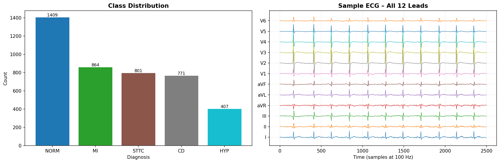
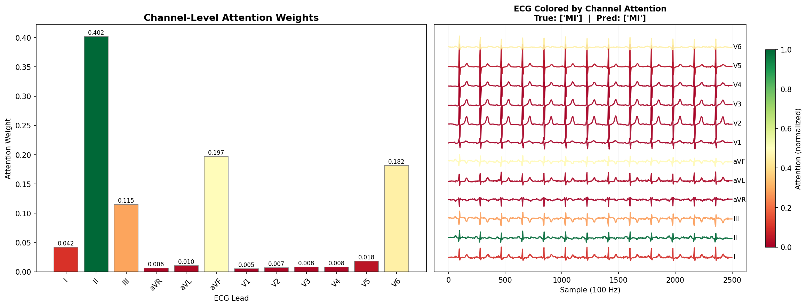

[](https://opensource.org/licenses/Apache-2.0)
[](https://www.python.org/)
[](https://www.tensorflow.org/)


# IMLE-Net: Phân Loại ECG Đa Kênh với Tập Dữ Liệu Tái Tạo

Dự án này mở rộng mô hình **IMLE-Net** (*An Interpretable Multi-level Multi-channel Model for ECG Classification*) của Likith Reddy et al. (IEEE SMC 2021) theo hai hướng:

1. **Huấn luyện trên tập dữ liệu gốc PTB-XL** (12 kênh ECG)
2. **Huấn luyện trên tập dữ liệu tái tạo** — sử dụng mô hình **RESCNN** để tái tạo 12 kênh từ 3 kênh (I, II, V2)

> **Bài báo gốc:** [IEEE Xplore](https://ieeexplore.ieee.org/document/9658706) | [arXiv](https://arxiv.org/abs/2204.05116)
> **Tác giả gốc:** Likith Reddy, Vivek Talwar, Shanmukh Alle, Raju. S. Bapi, U. Deva Priyakumar

---

## Mục Lục

- [Giới thiệu](#giới-thiệu)
- [Kiến trúc mô hình](#kiến-trúc-mô-hình)
- [Kết quả](#kết-quả)
- [Tập dữ liệu](#tập-dữ-liệu)
- [Cài đặt môi trường](#cài-đặt-môi-trường)
- [Huấn luyện trên PTB-XL (12 kênh)](#huấn-luyện-trên-ptb-xl-12-kênh)
- [Huấn luyện trên tập dữ liệu tái tạo (RESCNN)](#huấn-luyện-trên-tập-dữ-liệu-tái-tạo-rescnn)
- [Cấu trúc thư mục](#cấu-trúc-thư-mục)
- [Trích dẫn](#trích-dẫn)

---

## Giới Thiệu

Phát hiện sớm các bệnh tim mạch là yếu tố then chốt trong điều trị lâm sàng. Điện tâm đồ (ECG) 12 kênh là công cụ tiêu chuẩn để chẩn đoán các bệnh lý tim. Tuy nhiên, trong nhiều thiết bị wearable hoặc hệ thống giám sát từ xa, chỉ có thể thu thập được **3 kênh ECG** (I, II, V2).

Dự án này giải quyết bài toán đó theo hai bước:

- **Bước 1 — Tái tạo:** Dùng mô hình **RESCNN** để học ánh xạ từ 3 kênh → 12 kênh ECG đầy đủ.
- **Bước 2 — Phân loại:** Dùng mô hình **IMLE-Net** để phân loại bệnh lý tim từ tín hiệu ECG (gốc hoặc tái tạo).

IMLE-Net học đặc trưng ở 3 cấp độ: **beat (nhịp đập)**, **rhythm (nhịp tim)** và **channel (kênh)**, đồng thời cung cấp khả năng giải thích trực quan thông qua attention weights.

---

## Kiến Trúc Mô Hình

### IMLE-Net

```
Đầu vào: ECG 12 kênh (2500 mẫu × 12 kênh)
    │
    ├─► Beat-level module   (CNN + attention theo từng nhịp đập)
    ├─► Rhythm-level module (BiLSTM + attention theo chuỗi nhịp)
    └─► Channel-level module (attention trọng số kênh)
         │
         └─► Fully Connected → Softmax → 5 nhãn (NORM, MI, STTC, CD, HYP)
```

### RESCNN (Tái Tạo Kênh)

```
Đầu vào: ECG 3 kênh (I, II, V2)
    │
    ├─► Residual CNN blocks (đặc trưng thời gian-tần số)
    └─► Output: 12 kênh ECG được tái tạo
```

---

## Kết Quả

### Phân Phối Lớp (PTB-XL Test Set)

| Nhãn | Số lượng |
|------|----------|
| NORM | 1409 |
| MI   | 864  |
| STTC | 801  |
| CD   | 771  |
| HYP  | 407  |



### Hiệu Năng Phân Loại

|  Mô hình | Macro ROC-AUC | Mean Accuracy | Max. F1-score |
|----------|:-------------:|:-------------:|:-------------:|
| ResNet101 | 0.8952 | 86.78% | 0.7558 |
| Mousavi et al. | 0.8654 | 84.19% | 0.7315 |
| ECGNet | 0.9101 | 87.35% | 0.7712 |
| Rajpurkar et al. | 0.9155 | 87.91% | 0.7895 |
| **IMLE-Net (PTB-XL gốc)** | **0.9216** | **88.85%** | **0.8057** |
| **IMLE-Net (Tập tái tạo RESCNN)** | **0.9224** | **60.92%** | **0.7314** |

> **Chi tiết AUC theo từng lớp (tập tái tạo):**
>
> | NORM | MI | STTC | CD | HYP |
> |:----:|:--:|:----:|:--:|:---:|
> | 0.9502 | 0.9300 | 0.9193 | 0.9123 | 0.9003 |

### Trực Quan Hóa Attention

Hình dưới cho thấy attention weights theo từng kênh ECG. Với bệnh nhân MI, mô hình tập trung cao nhất vào kênh **II (0.402)**, tiếp theo là **aVF (0.197)** và **V6 (0.182)** — phù hợp với hướng dẫn lâm sàng về chẩn đoán nhồi máu cơ tim.



---

## Tập Dữ Liệu

### PTB-XL (Tập gốc)

Tập dữ liệu ECG công khai lớn nhất, gồm **21.837 bản ghi ECG 12 kênh** của **18.885 bệnh nhân**.

- Tải về từ [PhysioNet](https://physionet.org/content/ptb-xl/1.0.1/):

```bash
wget -r -N -c -np -nH --cut-dirs 4 -O data/ptb.zip \
  https://physionet.org/static/published-projects/ptb-xl/ptb-xl-a-large-publicly-available-electrocardiography-dataset-1.0.2.zip

unzip data/ptb.zip -d data/ \
  && mv data/ptb-xl-a-large-publicly-available-electrocardiography-dataset-1.0.2 data/ptb \
  && rm data/ptb.zip
```

### Tập Dữ Liệu Tái Tạo (RESCNN)

Tập dữ liệu PTB-XL được tái tạo từ 3 kênh (I, II, V2) thông qua mô hình RESCNN, đã được công bố công khai trên Kaggle:

> 📦 **[Reconstructed PTB-XL — Kaggle Dataset](https://www.kaggle.com/datasets/trnduynguyn/reconstructed-ptb-xl)**

Tải về và đặt vào thư mục `data/ptb_reconstructed/` trước khi chạy notebook huấn luyện.

---

## Cài Đặt Môi Trường

Trong Colab hoặc Kaggle Notebook, chạy cell sau ở đầu notebook:

```python
!pip install -r requirements.txt
```

Hoặc cài trực tiếp:

```python
!pip install wfdb neurokit2 scipy PyWavelets h5py scikit-learn tqdm seaborn kaggle
```

**Yêu cầu:**
- Python 3.7+
- TensorFlow 2.10+ (đã có sẵn trên Colab/Kaggle)
- Các thư viện còn lại xem trong `requirements.txt`

---

## Huấn Luyện Trên PTB-XL (12 Kênh)

Toàn bộ quá trình tiền xử lý, huấn luyện và đánh giá được thực hiện trong notebook:

> 📓 **[`IMLE_NET_TRAIN_PTB_XL.ipynb`](notebooks/IMLE_NET_TRAIN_PTB_XL.ipynb)**

Mở notebook, đảm bảo đường dẫn tới thư mục `data/ptb/` đúng, rồi chạy tuần tự các cell từ trên xuống.

---

## Huấn Luyện Trên Tập Dữ Liệu Tái Tạo (RESCNN)

Toàn bộ quá trình huấn luyện IMLE-Net trên tập dữ liệu tái tạo được thực hiện trong notebook:

> 📓 **[`IMLE_NET_TRAIN_RECONSTRUCTED.ipynb`](notebooks/IMLE_NET_TRAIN_RECONSTRUCTED.ipynb)**

**Trước khi chạy**, hãy tải tập dữ liệu tái tạo từ Kaggle về thư mục `data/ptb_reconstructed/`:

> 📦 **[Reconstructed PTB-XL — Kaggle Dataset](https://www.kaggle.com/datasets/trnduynguyn/reconstructed-ptb-xl)**

Sau đó mở notebook và chạy tuần tự các cell từ trên xuống.

---

## Cấu Trúc Thư Mục

```
PBL4_Aritificial_Intelligent/
├── Final_model/                             # File notebook huấn luyện mô hình
├── images/
│   ├── eda.png
│   └── attention_viz.png
├── README.md
└── requirements.txt
```

> **Lưu ý:** Toàn bộ pipeline (tiền xử lý, dataloader, huấn luyện, đánh giá, trực quan hóa) đã được tích hợp trực tiếp trong từng notebook chạy trên Colab / Kaggle.

---

## Trọng Số Mô Hình

| Mô hình | Tập dữ liệu | Link |
|---------|-------------|------|
| IMLE-Net | PTB-XL gốc | [best_model_weights.h5](https://drive.google.com/file/d/1-ZJSEr_NtbLXWWx5otXT5ItE5p-Wc0HN/view?usp=sharing). |
| IMLE-Net | Tập tái tạo RESCNN | [best_model_weights.h5](https://www.kaggle.com/code/trnduynguyn/ecg-12leads). |

---

## Trích Dẫn

Nếu bạn sử dụng code hoặc ý tưởng từ dự án này, vui lòng trích dẫn bài báo gốc:

```bibtex
@INPROCEEDINGS{9658706,
  author={Reddy, Likith and Talwar, Vivek and Alle, Shanmukh and Bapi, Raju. S. and Priyakumar, U. Deva},
  booktitle={2021 IEEE International Conference on Systems, Man, and Cybernetics (SMC)},
  title={IMLE-Net: An Interpretable Multi-level Multi-channel Model for ECG Classification},
  year={2021},
  pages={1068-1074},
  doi={10.1109/SMC52423.2021.9658706}
}
```

---

## Giấy Phép

Dự án được cấp phép theo [Apache License 2.0](LICENSE).
